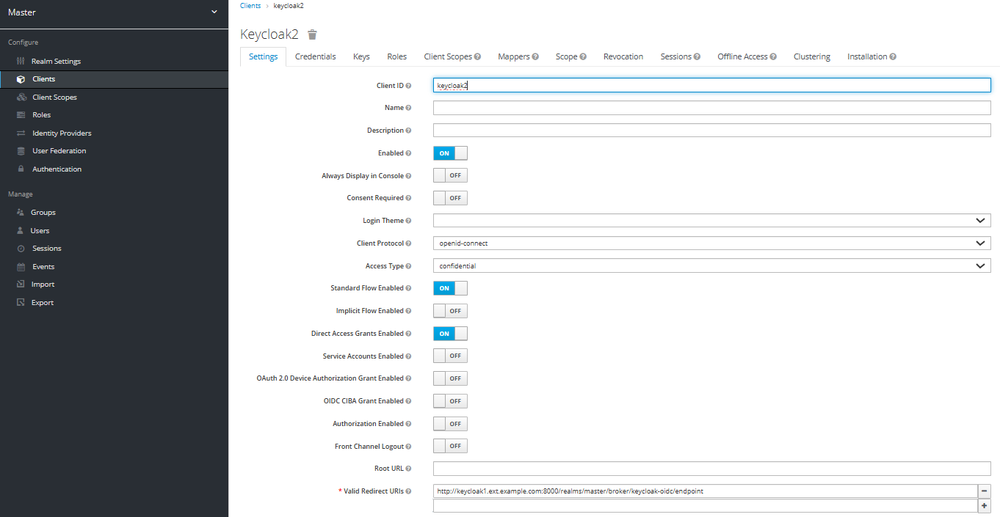
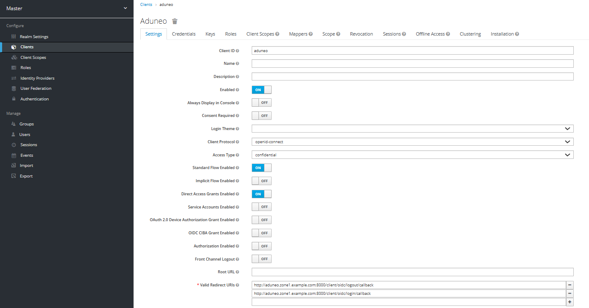
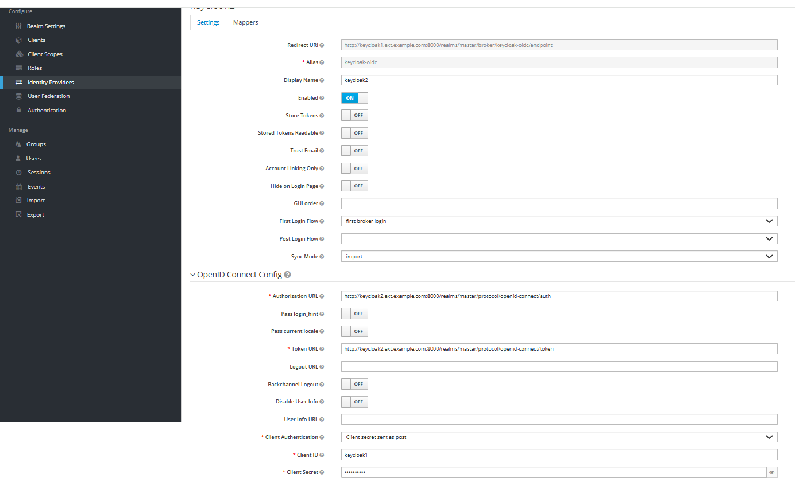
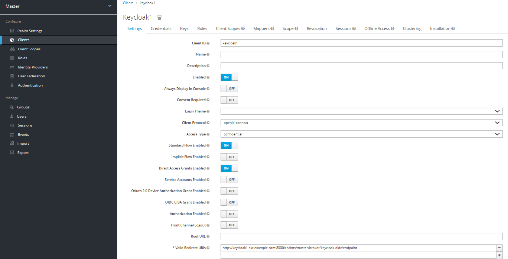
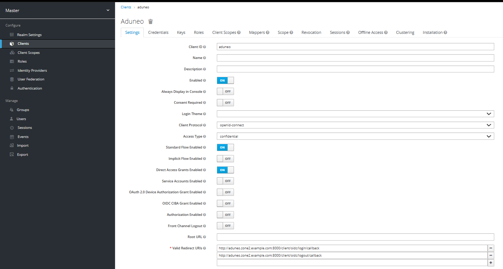

## Configuration du Keycloak1
### Client Keycloak2

### Client aduneo

### Identity provider keycloak2


## Configuration du Keycloak2
### Client Keycloak1

### Client aduneo (le second)


/etc/hosts
```bash
127.0.0.1 keycloak1.zone1.example.com aduneo.zone1.example.com keycloak2.zone2.example.com aduneo.zone2.example.com keycloak1.ext.example.com keycloak2.ext.example.com
```

## Simulation des zones
Pour simuler dans quelle zone tu te trouves, y'a juste à supprimer le `ports: 8000:8000` (L.50-51) et l'ajouter L.105.

## Config aduneo
Pour les configs aduneo, j'ai changé les dossiers de noms (aduneoconf-zoneX) avec mes fichiers cnf (surement à refaire à la main à cause des secrets)

## Lancement
Lors de plusieurs lancements, j'ai eu 2 nginx qui plantaient car ils ne se trouvaient pas l'un l'autre. (nginx-zone2 trouve pas nginx-main donc plante, puis le nginx-main ne trouve pas nginx-zone2 car il est planté et donc il plante lui aussi).

J'ai pas trouvé de bypass, tu peux pas les faire se dépendre entre eux dans le docker-compose.yAml.

La plupart du temps en faisait manuellement `docker compose down` et quelques secondes après un `./start.sh` ça marchait.
